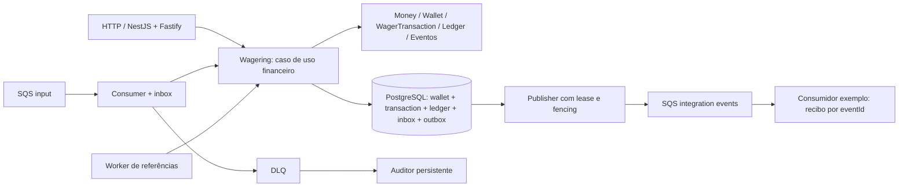

# Arquitetura, garantias e decisões

## Fluxo e fronteiras

O domínio não importa Nest, MikroORM, PostgreSQL ou AWS. Classes controlam dinheiro, transições, referências e aritmética do ledger por factories, métodos explícitos e reidratação. O controller valida o transporte e passa comando e contexto separados. O mesmo `Wagering.process` é chamado por HTTP, consumidor e worker de referências. Queries não alteram o domínio.

O adaptador `Database` delimita EntityManagers, transações e locks. MikroORM hidrata a wallet e acompanha suas alterações. SQL explícito dentro do mesmo EntityManager implementa uniques, inbox/outbox, leasing e checks que exigem controle preciso de concorrência. Os casos de uso assumem PostgreSQL; não prometemos substituição transparente por outro banco. Essa escolha mantém as garantias visíveis e verificáveis, sem um repositório genérico que esconda locks ou constraints. `Queues` encapsula o SDK e adapta URLs retornadas por ambos os emuladores. `IdentityPort` reserva a fronteira de identidade.

O TypeScript compila os decorators e seus metadados; Bun executa o JavaScript resultante. O smoke de Nest, Fastify, Swagger e MikroORM é exercitado em todos os testes de integração. Versões exatas, lockfile e digests delimitam a combinação validada.

## Dinheiro e operações

Money guarda centavos em bigint e é imutável. Conversão decimal usa exclusivamente strings. `NUMERIC(38,2)` admite até 36 dígitos inteiros; limites são verificados antes da escrita. Diferenças de reconciliação podem ser negativas, embora valores públicos e saldos persistidos não possam. Nenhum cálculo financeiro usa number; contadores, tempos e versões podem usá-lo.

| Operação         | Efeito e interpretação                                                                     |
| ---------------- | ------------------------------------------------------------------------------------------ |
| OPENING positivo | Crédito inicial interno, ledger versão 1 e eventos no mesmo commit                         |
| OPENING zero     | Wallet versão 1, sem transação financeira/ledger/evento de saldo                           |
| BET              | Débito positivo, rejeitado se saldo insuficiente                                           |
| WIN              | Crédito positivo; referência opcional exige BET processada, valor pode diferir             |
| LOSS             | Valor não negativo, decisão e evento; saldo/versão/ledger permanecem iguais                |
| REFUND           | Crédito integral de BET processada                                                         |
| ROLLBACK         | Inverso integral de BET, WIN ou REFUND processada; crédito ou débito conforme a referência |

Referências exigem mesmo provider, player, wallet, moeda e rodada. Game não é critério adicional de igualdade, seguindo o enunciado. BET/LOSS recusam referências; OPENING e provider `__system__` são internos. Reversões são exclusivas **por referência e tipo**: REFUND e ROLLBACK separados sobre a mesma BET são permitidos pelo texto do desafio, apesar de não ser uma regra usual em todo produto financeiro. Não inventamos uma exclusividade global diferente da especificada. Reversões parciais são rejeitadas.

A consequência dessa interpretação é explícita: saldo 100.00 → BET 30.00 → 70.00 → REFUND da BET → 100.00 → ROLLBACK da mesma BET → 130.00. O ledger permanece consistente, mas o efeito líquido é um crédito de 30.00. A regra adicional 4 da seção 7 restringe repetição pelo mesmo tipo de operação; uma exclusividade entre tipos exigiria outro contrato de negócio. Essa distinção precisa ser confirmada com o provedor antes de uma implantação real.

PENDING transiciona para PROCESSED, PENDING_REFERENCE, REJECTED ou FAILED. PENDING_REFERENCE pode continuar pendente ou terminar; terminações não reabrem. Reidratação reconstrói o estado existente e não reaplica regras de criação.

## Commit, concorrência e schema

Usamos READ COMMITTED e FOR UPDATE por wallet. Ordem: **wallet → inbox → transação**. Uma tentativa recebe um EntityManager exclusivo. Lock timeout 1 s, statement timeout 5 s e até três tentativas com backoff/jitter. Uma wallet bloqueada não serializa as outras. Referências são lidas sem lock de outra wallet; uma referência financeiramente válida necessariamente pertence à wallet já bloqueada. Estados terminais são imutáveis.

No commit ficam juntos: decisão/snapshot, wallet, ledger, inbox e eventos da outbox. Rejeições de negócio são dados persistidos. Erros técnicos abortam a transação; retry usa outro contexto. Falha permanente identificada, como permissão negada no ledger, pode ser registrada como FAILED em uma nova transação sem efeito financeiro. Se o próprio armazenamento da decisão estiver indisponível, mantemos retry/DLQ; não fingimos ter registrado FAILED.

O banco mantém uniques para player/moeda, chave idempotente global, provider/externalId, ledger por transação/wallet e wallet/versão, inbox por consumer/messageId, outbox eventId, auditoria DLQ e recibos de eventos. A identidade de uma wallet solicitada não tem FK na transação: uma wallet inexistente pode gerar rejeição auditável. Ledger exige wallet/transação existentes e mesma moeda/identidade.

Checks barram saldo negativo, valores inválidos/NaN e ledger aritmeticamente incorreto. Triggers barram mutação do ledger, alterações do comando, reabertura terminal, alteração de identidade inbox/outbox e resultado publicado. Constraints diferidas comparam saldo/versão, continuidade, operação/direção, referência e snapshot. Checam apenas os lançamentos relevantes, com índices por wallet/versão e transação; não somam todo o histórico em cada pagamento. A API aplica uma operação financeira por transação SQL.

`jungle_app` não é proprietário das tabelas e não tem UPDATE/DELETE/TRUNCATE no ledger. Migrations usam `jungle_owner`. Um administrador PostgreSQL continua podendo desabilitar triggers ou corromper dados; a reconciliação detecta esse cenário numa fixture isolada. Essa separação não pretende impedir um superuser.

## Idempotência e snapshots

SHA-256 sobre JSON com chaves ordenadas recursivamente. Campos de negócio do README entram; chave idempotente e contexto de transporte ficam fora. Money é normalizado e referência ausente vira null. UUIDs de jogador/wallet são normalizados para minúsculas.

Mesma chave/payload retorna o snapshot persistido. Mesma chave/payload divergente e identidade externa com nova chave retornam 409, sem tocar a operação original. Uniques e locks garantem esse resultado entre processos. A inbox verifica separadamente o hash do envelope completo; mesmo messageId com outro conteúdo não é aceito.

O saldo retornado é o saldo observado na decisão, e não o saldo atual em qualquer replay futuro. PENDING_REFERENCE guarda o primeiro snapshot; retries operacionais não o substituem. Na finalização, grava o snapshot terminal. HTTP 503 é inconclusivo: um cliente deve repetir a mesma chave/payload, pois pode haver commit seguido de falha de comunicação.

## Referências, transporte e DLQ

A inbox usa o messageId **do envelope**, não o dedupId FIFO nem exclusivamente o MessageId do broker. Mensagens pendentes são confirmadas depois do commit para não bloquear uma BET posterior no mesmo grupo FIFO. Workers persistentes reivindicam referências em uma transação curta com SKIP LOCKED, liberam-na e depois executam o caso financeiro na ordem de locks normal. Leases usam horário do banco e token de posse. Retries preservam snapshot e evento pendente único; TTL 24 h distingue referência inexistente de não processada. Referência terminal inválida rejeita imediatamente.

Recepção SQS: long polling 20 s, visibilidade 30 s, renovação 10 s, redrive 5 recebimentos. Negócio rejeitado recebe ack; transitório tem retry; permanente é encaminhado à DLQ antes do ack. Quando há inbox, o encaminhamento pendente fica persistido para retomada. O DLQ auditor grava raw body, hash e motivo antes de removê-lo, deduplicando a origem. Ele nunca reabre uma operação financeira confirmada. Esgotar entregas não torna uma indisponibilidade transitória automaticamente FAILED.

O SDK possui deadline nos envios/acks/consultas. Retry de transporte, retry de banco e retry de referência são contadores separados. Backoff tem jitter; as janelas de visibilidade/lease não são substitutos para idempotência.

## Outbox, duplicatas e shutdown

Outbox contém o envelope imutável criado dentro da transação financeira. Publishers reivindicam lote de até 20, com SKIP LOCKED e lease de 60 s. Enviam no máximo cinco simultaneamente, fora da transação financeira, com deadline de 5 s. Quando existe backlog, continuam drenando; quando o lote está vazio, esperam 500 ms. Isso evita uma pausa artificial em cada lote, um gargalo identificado no teste de carga.

Publicação confirmada exige o token de posse ainda vigente e lease não expirada. Worker antigo não sobrescreve sucessor. Falhas reagendam em até 5 min; o registro confirmado permanece até envio bem-sucedido. Morte depois do envio e antes da marcação pode reenviar o evento: eventId permanece igual. FIFO dedup é uma otimização limitada no tempo. Consumidores precisam dedup persistente; o exemplo usa consumer/eventId. Eventos de saldo incluem walletVersion; múltiplos publishers podem publicar fora de ordem financeira, então consumidores de projeção devem tratar versões/gaps.

SIGTERM para novas recepções, cancela long polling e drena trabalho por até 25 s. Depois cancela as renovações de visibilidade e devolve as mensagens restantes, com deadline adicional de 1 s e o cliente SQS ainda aberto. O encerramento reserva essa etapa antes de fechar as dependências; workers de outbox/referência também têm drenagem limitada. Se SQS estiver indisponível durante a devolução, a visibilidade original expira normalmente. Transações inacabadas são revertidas quando a conexão/processo termina; leases abandonadas expiram. Todas as garantias dependem da durabilidade do commit PostgreSQL e da confirmação durável de SQS.

## Consultas e diagnóstico

Ledger usa cursor base64url com walletId, último item e limite superior fixado na primeira página; movimentos novos não se misturam às páginas seguintes. O cursor organiza paginação e não é um mecanismo de autorização. Reconciliação usa REPEATABLE READ, soma decimal exata e diferença assinada; responde, loga e incrementa métrica quando há divergência. Não corrige automaticamente.

Logs registram correlationId, messageId quando aplicável, transactionId, walletId e providerId, sem payload financeiro completo. Métricas não usam identidades individuais como labels. Liveness não chama dependências; readiness verifica PostgreSQL e as três filas. Instâncias somente de workers podem adicionar o papel api para expor health/metrics.

`wager_retries_total{component="reference"}` conta cada tentativa reivindicada de reprocessamento de uma decisão pendente, inclusive a que a finaliza com sucesso. É uma contagem de retentativas, não de falhas. Nos demais componentes, o contador é incrementado ao tratar uma falha para nova tentativa. Um primeiro reprocessamento bem-sucedido de referência continua sendo uma retentativa da submissão original.

## Identidade, ambientes e limites

O enunciado permite focar nos critérios financeiros e documentar a identidade. DevelopmentIdentity é deliberadamente sem autenticação. `IdentityGuard` é registrado globalmente e consulta `IdentityPort` uma vez em cada rota de negócio e em `/metrics`; apenas os handlers de health têm exceção explícita. O adaptador pode ser fornecido ao configurar `ApiModule`. Um teste HTTP real com adaptador restritivo comprova recusa de todas essas rotas e health público. Swagger é servido separadamente pelo plugin e fica aberto neste perfil local.

Para implantação exposta, implementar adapter OIDC/JWKS com verificação de issuer, audience, assinatura, expiração e rotação, e autorização de provider/player/wallet; derivar o provider do principal verificado e não confiar no body. O guard global é a fronteira existente, mas não implementa essas verificações no modo development. Credenciais locais do banco e AWS fictícias são exclusivas do Compose; produção precisa secrets, TLS, grants e observabilidade próprios.

LocalStack é a validação principal; MiniStack executa a mesma suíte portátil. Snapshots no shutdown e load no startup usam a [configuração documentada de persistência](https://docs.localstack.cloud/aws/developer-tools/snapshots/persistence/). Periodic snapshots causaram bloqueios durante long polling no ambiente validado; a configuração escolhida remove essa interferência. Ela preserva reinício **gracioso** do broker, mas não promete durabilidade de mensagens do emulador após SIGKILL. A recuperação de crashes de aplicação é testada separadamente. Em AWS real, a durabilidade do serviço SQS é a fronteira externa.

Sem poda automática de ledger, transações, inbox/outbox publicadas ou auditoria: preservar evidência é adequado ao desafio; produção exigiria política de retenção, partições e backups sem quebrar idempotência. Sem balanceador de carga, Kubernetes, cache financeiro, correção automática de saldo ou IdP ativo. Essas extensões não substituem as provas de consistência.

O benchmark local mede três processos e duas distribuições de wallet, com aquecimento, repetições, rejeições esperadas e outbox lag. Ele evidencia contenção por wallet e capacidade distinta do publisher; não define SLA ou RPS de produção. [Resultados](docs/results/README.md).
